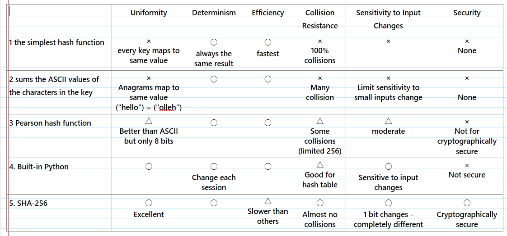

# Overview

These questions are designed to accompany the task "Implementing a Hash Map in Python" in the "Data Structures and Algorithms" module. The questions are intended to test your understanding of hash maps, their implementation in Python, and the process of integrating data from a double linked list into a hash map. You will also be asked to reflect on your learning and the challenges you faced during the task.

# Knowledge questions

The following are all examples of hash functions:

```python
# (1) the simplest hash function (Stupidly Simple Hash)
def ssh(key):
    return 1
```

```python
# (2) hash function that sums the ASCII values of the characters in the key
def sum_of_ascii_values(key: str, size: int) -> int:
    total = 0
    for char in key:
        total += ord(char)
    return total % size
```

A more Pythonic version

```python
# (2a)
def sum_of_ascii_values(key: str, size: int) -> int:
    return sum(ord(char) for char in key) % size
```

A Pearson Hash function

```python
# (3) Pearson hash function
# https://en.wikipedia.org/wiki/Pearson_hashing
import random

random.seed(42)

# This is INCORRECT:
# pearson_table = [random.randint(0, 255) for _ in range(256)]
pearson_table = list(range(256))
random.shuffle(pearson_table)

def pearson_hash(key: str, size: int) -> int:
    hash_ = 0
    for char in key:
        hash_ = pearson_table[hash_ ^ ord(char)]
    return hash_ % size
```

The following is a hash function that uses the built-in `hash` function in Python

```python
# (4) hash function that uses the built-in hash function
def built_in_hash(key: str, size: int) -> int:
    return hash(key) % size
```

Finally, the following is a hash function that uses the `SHA256` hash function from the `hashlib` module

```python
# (5) hash function that uses the SHA256 hash function
# https://docs.python.org/3/library/hashlib.html
# https://en.wikipedia.org/wiki/SHA-2
# https://en.wikipedia.org/wiki/SHA-2#Pseudocode
import hashlib

def sha256_hash(key: str, size: int) -> int:
    return int(hashlib.sha256(key.encode()).hexdigest(), 16) % size
```

1. All of the above functions are hash functions. Explain how so - what key properties do they all share?

> These function are all hash functions because all inputs (key) are converted to numerous index. 
> Mapping arbitrary-length data to fixed-range integers (0 to size -1)

2. What are the advantages and disadvantages of each of the above hash functions? Evaluate in terms of uniformity, determinism, efficiency, collision resistance, sensitivity to input changes, and security[1](#Reference). You may need to do some reasearch to answer this question 😱
> 
> 
> 
> 1. simplest hash function  
>   It is decisive and calculates at an extremely fast, However, uniformity ias at the worst 
     > because all keys are mapped to the same value. As the result, the collision rate is 
     > at the maximum, it reacts not at all to changes in input, and security is completely 
     > non-existent.  
> 2. sums the ASCII values 
>   It is decisive and provides some distribution, but uniformity is low, and anagrams(eg, 
     > "abc" and "cba") collide to produce the same value. it is insensitive to minor 
     > changes in input and lacks security.  
> 3. Pearson hash function  
>    It is more sophisticated. By using substitution tables to mix the input characters, it 
     > achieves a better distribution than ASCII sum. It's also decisive and efficient, and 
     > is sensitive to changes in the input to a certain extent. However, as the output is 
     > limited to 8 bits, collisions remain frequent and it lacks cryptographic security.  
> 4. Built-in Python  
>   It's designed for use with hash table, and provides relatively good distribution and is 
     > highly efficient. While deterministic within a single execution, its output changes 
     > across sessions. It is sensitive to input variations, but cannot be used for 
     > cryptographic purposes and offers no security.  
> 5. SHA-256  
>   It is the most powerful, and uniformly distributed across an extremely large output 
     > space, possesses extremely high collision resistance, and even a single bit change in 
     > the input causes a significant change in the output. It is cryptographically secure 
     > and is ideal for application requiring reliability and security. Its only drawback is 
     > that is slower than other methods, but it is still sufficiently practical for many 
     > applications.  
> 


3. List the three most important attributes (arranged from most to least) in the context of a hash map? Justify your answer.

>   • Fast lookup(O(1))…directly map key to memory location  
>   • Flexibility… dictionaries allows to immutable data types to be used as keys.  
>   • Dynamic Size… dictionaries automatically manage storage capacity. When elements are   
added and removed, dictionaries grow or shrink .

4. Which of the above hash functions would you choose to implement the requirements of the task? Why?

> I used simple hush and built-in hash() function for this task. 
> When the key is not a Player object, I used Python built-in hash() function. 
> It may map to different value each session, 
> However, it provide good distribution and efficiency for general key. 
> When key is player object, I want to remain consist across sessions, 
> so I used simple hash in my_hash function. 
> This ensures that each Player's uid always maps to the same value.

5. In your own words, explain each line in the pearson hash function above in terms of the criteria you listed in question 2.

> import random 
> - Import the random module to use shuffle numbers to create the lookup table
> 
> random.seed(42)
> - By setting a fixed seed, random operations such as shuffling will consistently produce 
> the same result.
> 
> Determinism: Ensure that the same tables are generated each time, 
> guaranteeing that the hash function always returns consistent results.
> 
> pearson_table = list(range(256))
> - Create a table of number (0-255)
> 
> random.shuffle(pearson_table)
> - Shuffle the numbers in the list to create a randomly rearranged lookup table.
> 
> Uniformity: helps to spread the hash values more evenly across the entire output. 
> Collision resistance: Improved compared to simple ASCII value sum methods. 
> Determinism: Guaranteed due to the fixed seed. 
> Security: Not cryptographically secure because of the table is fixed and small.
> 
> def pearson_hash(key: str, size: int) -> int:
> - define pearson_hash function 
> - Input key(string) and size(size of the hash table)
> 
> hash_ = 0
> -Initialize the hash value to 0
> 
> for char in key:
> - Loops through each character in the string
> 
> hash_ = pearson_table[hash_ ^ ord(char)]
> - ord(char): converts to character to ASCII value 
> - hah_ ^ ord(char): XORs the current hash with this value 
> - hash_ : Use the result as an index to take the value from pearson_table and set it as the new hash_.
> 
> Input Sensitivity: small changes in the string produce different hash values. 
> Collision Resistance: reduces collisions compared to simple sums. 
> Efficiency: simple integer operations in a loop
> 
> return hash_ % size
> - After processing all characters, return the remainder when the hash value is divided by size.
> - This ensures the result falls within the range 0 to size-1, and can be used as a hash table index.
> 
> Uniformity: distributes hash values evenly across available indices.
> Determinism: same input always produces same index.

> 


6. Write pseudocode of how you would store Players in PlayerLists in a hash map.

> Define class Player:  
>   attributes:  
>       uid: (unique identifier, string)  
>       name: (string)  
> 
> Define class PlayNode:  
>   attributes:   
>       player: (player of player object)  
>       next:   (PlayerNode or None)  
>       prev:   (PlayerNode or None)  
> 
> Define class PlayList:  
>   attributes:   
>       head: (PlayerNode or None)  
>       tail: (PlayerNode or None)  
> 
>   method update_player(player: Player)  
>       new_node = PlayerNode(player)  
        if head is None:  
            head = new_player  
            tail = new_player  
        else:  
            tail.next = new_player  
            new_player.prev = tail  
            tail = new_player  
> 
>   method find_key(key: player) -> PlayerNode or None:  
>       current_node = head  
        while current_node EXISTS:  
            if current_node.player.uid == key.uid:  
                return current_node  
            current_node = current_node.next  
        return None  
> 
> Define PlayerHashMap:  
>   attributes:  
>       size: default 10  
>       hashmap: array of PlayerList objects, length = size  
>       count: number of players stored  
>   
>   method get_index(key):  
>       if key is a Player object:  
>           convert key.uid to integer  
>           return (integer uid % size)  
>       else:  
>           return hash(key) % size  
> 
>   method set_item(key: Player, name: string )  
>       index = get_index(key)  
>       player_list = hashmap[index]  
>       existing_node = player_list.find_key(key)  
>       if existing_node EXISTS:  
>           update existing_node.player.name to name  
>           update existing_node.player.uid to uid  
>       else:  
>           create new player object with uid and name  
>           add new player to player_list  
>           increment count by 1  
> 
>   method get_item(key: Player):  
>       index = get_index(key)  
>       player_list = hashmap[index]  
>       node = player_list.find_key(key)  
>       if node EXISTS:  
>           return node.player.name  
>       else:  
>           return None  
> 
>   method delete_item(key: Player):  
>       index = get_index(key)  
>       player_list = hashmap[index]  
>       node = player_list.find_key(key)
>       if node EXISTS and node.player.uid == key.uid:    
>           remove node from player_list  
>           decrement count by 1  
>       else:  
>           print "player not found"  
> 
>   method length():  
>       return count  
> 
>   method display():  
>       for each index i and player_list in hasmap  
>           print index and contents of player_list  
> 
>       
>       
> 
> 
>   
>       

## Reflection

1. What was the most challenging aspect of this task?

> The most challenging aspect was implementing get_index.
> At first, I used Python's built-in function on the Player object,
> but this hash value changed with each execution, which meant that even the same uid would 
> return a different index each time. Therefore, I changed it to use a simple hash function
> (uid % size), ensuring that the same uid always returns the same index.

2. If you didn't have to use a PlayerList, how would you have changed them implementation of the hash map and why?

> In this case, the requirements was to overwrite name when a hash collision occurs,
> so there is no need to use PlayerList. 
> Instead, we will change the design to store Player objects directly in an array of hash maps.
> This approach eliminates unnecessary list operations, resulting in a simpler and more 
> straightforward implementation. 

## Reference

### Key Dimensions of Hash Functions

1. **Uniformity**: the probability of any given hash value within the range of possible hash values should be approximately equal.

2. **Determinism**: a given input will always produce the same output.

3. **Efficiency**: the time complexity of computing the hash value should be constant, the hash function should be fast to compute, and utilize the architecture of the computer effectively

4. **Collision Resistance:** minimize the probability of collisions, through a variety of mechanisms.

5. **Sensitivity to input changes:** small changes in the input should produce large changes in the output.

6. **Security**
   - It should be computationally infeasible to find an input key that produces a specific hash value (non-reversibility)
   - The output hash values should appear random and unpredictable.
